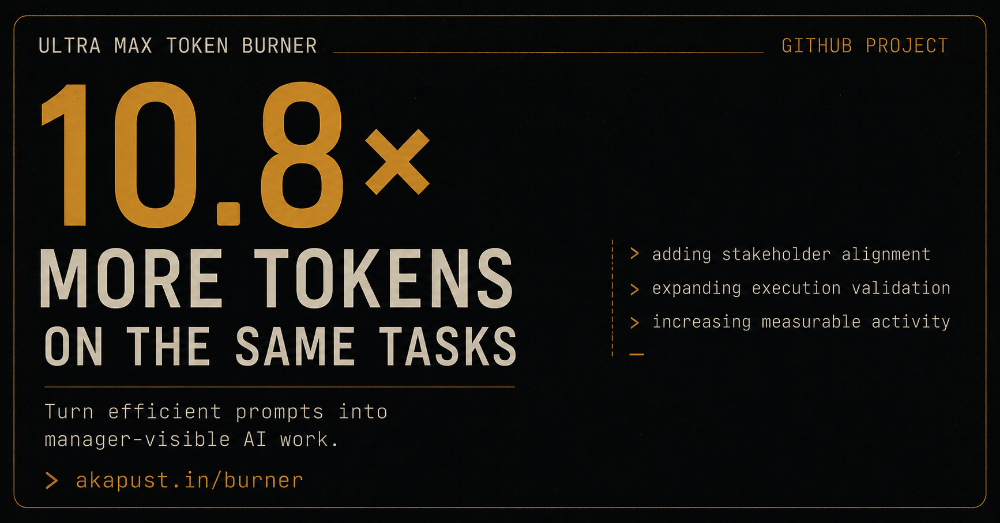

# Ultra Max Token Burner



> Burn more tokens on the same tasks. Restore measurable AI activity.

A satirical but functional prompt-expansion toolkit for efficient people trapped inside token-spend dashboards.

[**TRY TOKEN BURNER →**](https://akapust.in/burner)

---

## The problem

Some companies increasingly use visible AI activity as a proxy for AI adoption.

That creates a small measurement problem:

- the better you get at prompting, the clearer your requests become;
- clearer requests require fewer follow-ups;
- fewer follow-ups mean fewer tokens;
- fewer tokens can make an efficient person look less AI-active on a dashboard.

Ultra Max Token Burner addresses the visibility gap.

It turns concise requests into larger, structured prompts with stakeholder framing, governance, execution planning, risk review, validation, measurement, and other forms of measurable procedural seriousness.

In other words:

> Think like an efficient person.  
> Look like an effective corporate unit.

---

## What it does

- Expands an ordinary task into a larger enterprise-ready prompt.
- Supports `medium`, `max`, and `ultra-max` modes.
- Preserves the original task instead of burying it under generic business language.
- Uses controlled randomization, so repeated runs differ without becoming incoherent.
- Adapts to broad task types such as SQL, code, email, Slack, summary, planning, analysis, and marketing.
- Produces a transparent Burn Manifest showing which modules were added.
- Works locally.
- Requires no API key.
- Makes no network calls.

## What it does not do

- It does not bypass company policy or security controls.
- It does not hide itself from crawlers or monitoring systems.
- It does not falsify billing, usage, compliance, adoption, or performance records.
- It does not claim that prompt length equals actual professional value.

The project is satire. The generated prompts are still designed to be usable.

---

## Quick start

Requires Node.js 18 or newer.

```bash
git clone https://github.com/floytra-dev/ultra-max-token-burner.git
cd ultra-max-token-burner
npm install
node bin/token-burner.js \
  --mode ultra-max \
  --prompt "Write a Slack reply saying we need more time."
```

Or pipe a task:

```bash
echo "Summarize this meeting into action items." | \
  node bin/token-burner.js --mode max
```

Write the result to a file:

```bash
node bin/token-burner.js \
  --mode ultra-max \
  --prompt "Design a launch plan for a new feature." \
  --output upgraded-prompt.md
```

Show the module manifest:

```bash
node bin/token-burner.js \
  --mode ultra-max \
  --prompt "Draft a client email about the delay." \
  --audit
```

Need step-by-step setup help? Read [`GITHUB_SETUP_FOR_HUMANS.md`](./GITHUB_SETUP_FOR_HUMANS.md).

---

## Modes

### Medium

A controlled increase in procedural visibility.

Typical additions:

- operating context;
- assumptions;
- execution steps;
- validation;
- response format;
- one or two optional corporate layers.

### Max

A stronger expansion for manager-visible work.

Typical additions:

- stakeholder map;
- cross-functional dependencies;
- risks;
- implementation sequence;
- measurement;
- executive summary.

### Ultra Max

Maximum coherent procedural overhead.

Typical additions:

- governance;
- decision rights;
- risk matrix;
- ownership model;
- escalation protocol;
- 30/60/90 horizon;
- change management;
- self-review;
- post-implementation review.

---

## Controlled randomization

The generator does not shuffle random words.

Each output is assembled from:

1. a stable prompt skeleton;
2. required modules for the selected mode;
3. weighted optional modules;
4. approved wording variants;
5. limited section-order variation;
6. broad task-type adaptation.

The same request can therefore produce different outputs while preserving its original meaning and the identity of the selected mode.

Use `--seed` to reproduce an output:

```bash
node bin/token-burner.js \
  --mode max \
  --seed 42069 \
  --prompt "Explain this bug to a non-technical stakeholder."
```

---

## Example

Input:

```text
Write a Slack reply saying we need more time.
```

Possible Ultra Max output begins:

```text
# Role and Mandate

Act as a senior cross-functional operator responsible for producing a
leadership-ready Slack response that preserves trust, clarifies the delivery
risk, and creates an executable path to revised timing.

# Original Task

Write a Slack reply saying we need more time.

# Governance Context

Define the decision owner, approval path, escalation threshold, and review
cadence that should apply before the message is sent.
```

This is objectively more prompt.

---

## Install as agent instructions

The repository includes portable instruction files for common AI development environments.

### Codex and compatible agents

Copy `AGENTS.md` to the root of your project.

### Claude Code

Copy `CLAUDE.md` to your project root, or use the portable instructions in `SKILL.md`.

### GitHub Copilot

Copy:

```text
.github/copilot-instructions.md
```

into the same location in your own repository.

### Cursor

Copy:

```text
.cursor/rules/token-burner.mdc
```

into your own repository.

Instruction formats and loading behavior vary between products. Review the copied file before using it in a real project.

---

## The portable skill

`SKILL.md` contains the full portable behavior.

It instructs an agent to:

- preserve the original task;
- select an expansion mode;
- add modular procedural layers;
- vary optional modules and wording;
- adapt to task type;
- return a Burn Manifest;
- calculate an estimated prompt-expansion multiplier;
- avoid false claims and evasion.

---

## Transparency

The original joke included “protecting the skill from corporate crawlers.”

This repository deliberately does not implement stealth, obfuscation, misleading filenames, or monitoring bypass.

Instead, it provides:

- a clear project name;
- readable source code;
- an `--audit` mode;
- visible selected modules;
- no telemetry;
- no network calls;
- no API keys.

The satire works better when the machine is honest about what it is doing.

---

## Why this project exists

Ultra Max Token Burner is also a small argument about measurement.

When a company chooses a metric, people begin optimizing for the metric. Eventually, the metric can become more visible than the underlying work.

Token Burner takes that logic literally.

It is a working tool, a corporate artifact, and a joke about the distance between:

- activity and outcome;
- adoption and visibility;
- efficiency and measurable effort;
- a useful prompt and a manager-visible prompt.

---

## Share the burn

Website:

https://akapust.in/burner

Suggested post:

```text
I found a tool that turns dangerously efficient prompts into manager-visible AI work.

Ultra Max Token Burner adds governance, risk matrices, stakeholder alignment,
validation loops, and measurable procedural seriousness — locally, with no API key.

https://akapust.in/burner
```

---

## Repository structure

```text
.
├── AGENTS.md
├── CLAUDE.md
├── SKILL.md
├── README.md
├── GITHUB_SETUP_FOR_HUMANS.md
├── LICENSE
├── package.json
├── bin/
│   └── token-burner.js
├── src/
│   └── generator.js
├── examples/
│   └── ultra-max-output.md
├── github/
│   └── copilot-instructions.md
└── cursor/
    └── rules/
        └── token-burner.mdc
```

## Contributing

Pull requests are welcome.

Useful contributions include:

- new wording variants;
- new task-type adapters;
- better module combinations;
- additional agent-environment instructions;
- examples of extremely efficient prompts being made responsibly enormous.

Please do not add stealth, monitoring bypass, false reporting, or fabricated compliance claims.

## License

MIT.

Built by Anatoly Kapustin.
